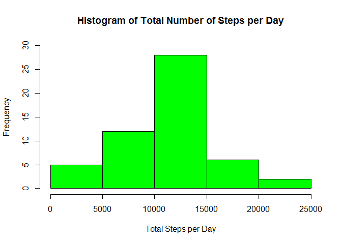
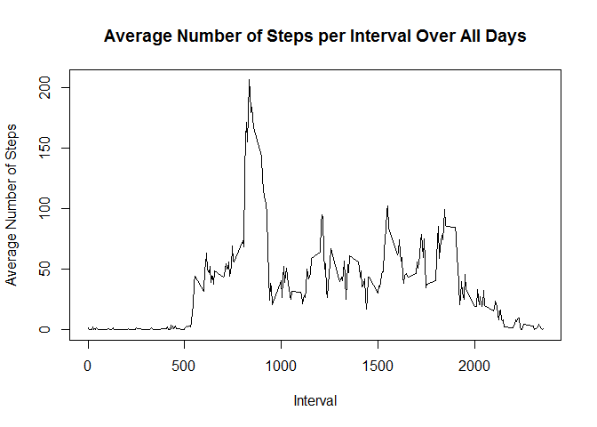
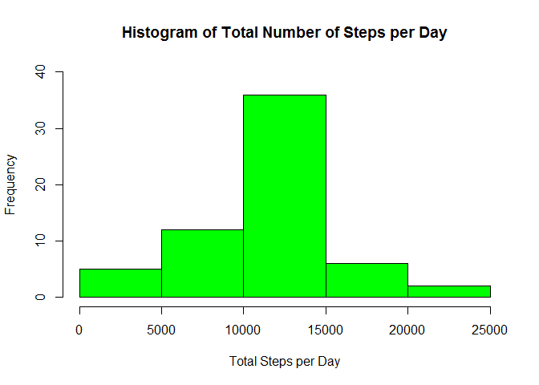
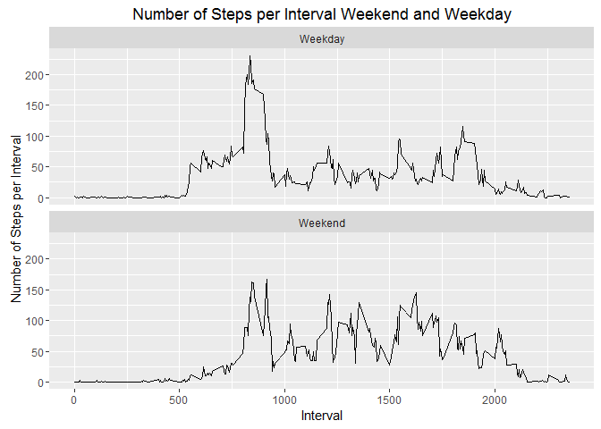

# Reproducible Research: Peer Assessment 1
### Loading and preprocessing the data

**File activity.zip from this repo should be located in your working directory. Data will be stored in Data Frame: activity. No preprocessing is done for now.**


```r
# unzipping and loading the data
unzip('activity.zip')
activity <- read.csv("activity.csv",  header = T, sep = "," )
```
&nbsp;
&nbsp;

### What is mean total number of steps taken per day?

**Creating the Histogram of the total number of steps taken each day.**

For this step the steps variable will be summarized per date.


```r
# aggregate the data:
sumperday <-aggregate(steps~date,activity,sum, na.rm= TRUE)

# Histogram of the Total Number of Steps per Day

hist(sumperday$steps, col="green" , ylim=c(0,30), main="Histogram of Total Number of Steps per Day", 
     xlab="Total Steps per Day")
```

<!-- -->
&nbsp;
    
**The below code calculates the mean and median for the steps taken each day:**

Mean of steps taken each day:


```r
mean(sumperday$steps, na.rm= TRUE)
```

```
## [1] 10766.19
```

Median of steps taken each day:


```r
median(sumperday$steps, na.rm= TRUE)
```

```
## [1] 10765
```
&nbsp;
&nbsp;  
    
### What is the average daily activity pattern?

**Creating time series plot of the average number of steps taken**

For this step the mean of the steps per interval will be aggregated.


```r
# calculating the mean per interval
meanperint <- aggregate(steps~interval, activity, mean, na.rm= TRUE)

# Time series plot of the average number of steps taken
plot(meanperint, type="l", main="Average Number of Steps per Interval Over All Days", xlab="Interval", 
     ylab="Average Number of Steps")
```

<!-- -->

**The below code shows the interval with maximum of steps in average over the time**


```r
# get the interval with maximum of steps in average over the time
meanperint[which.max(meanperint$steps),]
```

```
##     interval    steps
## 104      835 206.1698
```
&nbsp;
&nbsp;

### Imputing missing values

**The below code is used to figure out which of the 3 variables has missing values:**


```r
# calculate the total number of missing values
sapply(activity, function(y) sum(is.na(y)))
```

```
##    steps     date interval 
##     2304        0        0
```

**It shows that only variable steps has missing values.**
&nbsp;
&nbsp;

**A new copied Data Frame activity1 is used from now on. I decided to us the mean of steps per interval for imputing missing values. Below is the code to do this**


```r
# using the mean per interval to fill the NA values for steps

# creating a new data frame as copy
activity1 <- activity

# filling the the NA values
for (i in 1:nrow(activity1)) {
    if(is.na(activity1$steps[i])) {
        activity1$steps[i] <- meanperint$steps[which(meanperint$interval == activity1$interval[i])]
        }
}
```

**Creating the Histogram of the total number of steps taken each day on the imputed data frame:**

For this step the steps variable will be summarized per date the same way as done before.


```r
# aggregate the data:
sumperday1 <-aggregate(steps~date,activity1,sum)

# Histogram of the Total Number of Steps per Day
hist(sumperday1$steps, col="green" , ylim=c(0,40), 
     main="Histogram of Total Number of Steps per Day", xlab="Total Steps per Day")
```

<!-- -->

**The below code calculates the mean and median for the steps taken each day on the imputed data frame:**

Mean of steps taken each day:


```r
mean(sumperday1$steps)
```

```
## [1] 10766.19
```

Median of steps taken each day:


```r
median(sumperday1$steps)
```

```
## [1] 10766.19
```

**This shows that there is just a very small change in the the median.**

&nbsp;
&nbsp;
### Are there differences in activity patterns between weekdays and weekends?

**The data is processed the following way:**  

* Date variable has been changed to date format.
* A new factor variable in the dataset with two levels - "Weekday", "Weekend" indicating whether a given date is a weekday or weekend day.
* Calculate the mean of steps per interval/weekdays 
* Time series plots are generated to compare the number of steps per interval using ggplot


```r
library(ggplot2)
```

```
## Warning: package 'ggplot2' was built under R version 3.2.5
```


```r
# changing date column factor/string to date
activity1$date <- as.Date(activity1$date, "%Y-%m-%d")

# converting to weekend / weekday factor    
activity1$weekdays <- weekdays(activity1$date, abbreviate = T)
activity1$weekdays <- factor(ifelse(activity1$weekdays %in% c("Sat", "Sun"), "Weekend", "Weekday"))

# aggregating the data again
meansteps <- aggregate(steps ~ interval+weekdays, activity1 , mean)

qplot(interval, steps, data=meansteps, geom=c("line"), 
      xlab="Interval", ylab="Number of Steps per Interval", 
      main="Number of Steps per Interval Weekend and Weekday") + facet_wrap( ~ weekdays , ncol=1)
```

<!-- -->
&nbsp;

**The plot show that there is a difference in the activity patterns between weekdays and weekends.**
